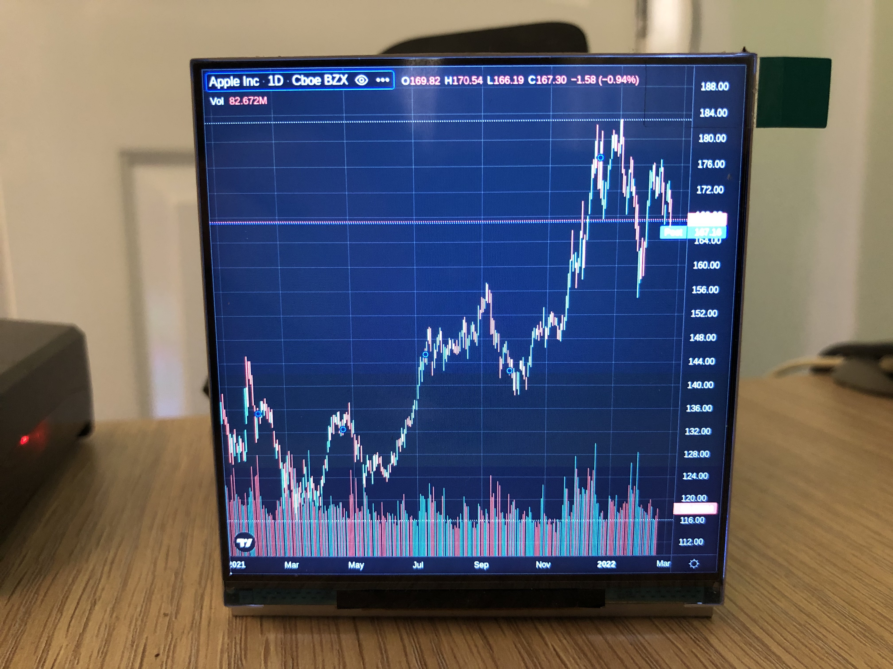

# BlitBot
> Blazor Server app for showing market charts




- uses trading view widget
- config editor web-page allows live updates to the chart view on other devices.

> shell cmds for kiosk setup (based on buster lite image, bullseye fails)

```sh

# install hyperpixel drivers
curl https://get.pimoroni.com/hyperpixel4 | bash

# install minimal gui packages
sudo apt-get install -y --no-install-recommends xserver-xorg x11-xserver-utils xinit openbox chromium-browser

# Remove exit errors from the config files that could trigger a warning
# sed -i 's/"exited_cleanly":false/"exited_cleanly":true/' ~/.config/chromium/'Local State'
# sed -i 's/"exited_cleanly":false/"exited_cleanly":true/; s/"exit_type":"[^"]\+"/"exit_type":"Normal"/' ~/.config/chromium/Default/Preferences

# setup gui autostart
echo '

# disable screen power management
xset -dpms            # turn off display power management system
xset s noblank        # turn off screen blanking
xset s off            # turn off screen saver


# run Blitbot
~/.dotnet/dotnet run --project ~/BlitBot/BlitBot > /dev/null 2>&1 &

# Run Chromium in kiosk mode
chromium-browser  --noerrdialogs --disable-infobars --check-for-update-interval=31536000 --kiosk $KIOSK_URL ' | sudo tee -a  /etc/xdg/openbox/autostart


# start x-server on boot
echo '[[ -z $DISPLAY && $XDG_VTNR -eq 1 ]] && startx -- -nocursor' | sudo tee -a ~/.bash_profile

# setup global kiosk url
echo 'export KIOSK_URL=http://localhost:5009/FullChart' | sudo tee -a /etc/xdg/openbox/environment

# set the pi to autologin
sudo raspi-config nonint do_boot_behaviour B2

# setup .net
curl -sSL https://dot.net/v1/dotnet-install.sh | bash /dev/stdin --channel Current
echo 'export DOTNET_ROOT=$HOME/.dotnet' >> ~/.bashrc
echo 'export PATH=$PATH:$HOME/.dotnet' >> ~/.bashrc
source ~/.bashrc
# check it worked
dotnet --version

# checkout the BlitBot code
git clone https://github.com/donbing/BlitBot.git

```


# TODO

 - exchange search input
 - configure when to show the TA widget
 - add VNC server
